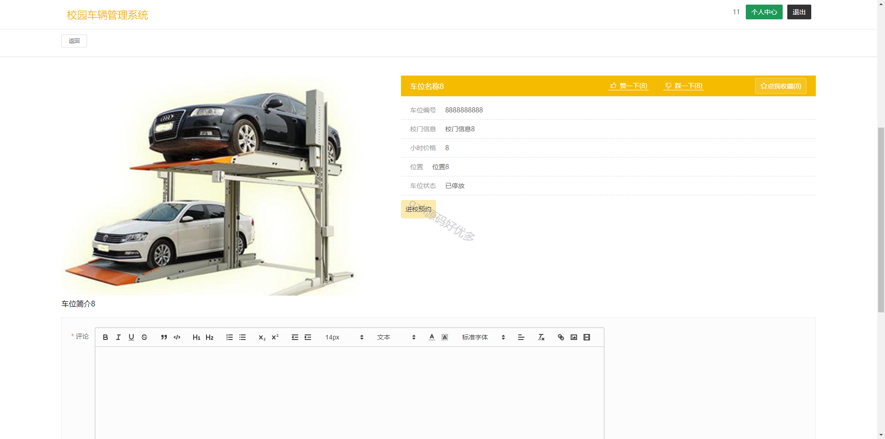
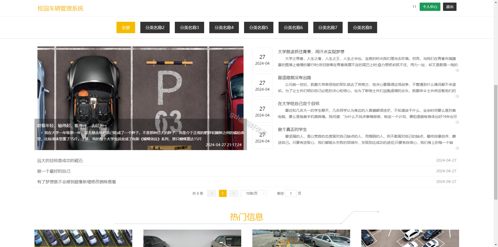

# springbootA352
springbootA352校园车辆管理系统LW
 
## 查看主页获取源码

### 一、作品包含

源码+数据库+设计文档万字+全套环境和工具资源+部署教程

### 二、项目技术

前端技术：Html、Css、Js、Vue2、Element-ui

数据库：MySQL

后端技术：Java、Spring Boot、MyBatis

  

### 三、运行环境

开发工具：IDEA/eclipse

数据库：MySQL5.7

数据库管理工具：Navicat10以上版本

环境配置软件： JDK1.8+Maven3.6.3

前端Nodejs：14

### 四、项目介绍
项目编号：springbootA352

本系统的开发提升了校园的信息管理水平，管理者只需公布校园车辆管理系统网站，用户就能按需灵活运用系统功能，突破时间和地点的束缚，有效提升车辆信息管理效率

校园车辆管理系统角色为管理员和前台用户功能如下：前台门户、用户管理、校门信息管理、车位信息管理、进校管理、车辆离校管理、校园论坛管理、系统管理

### 五、运行截图

  
